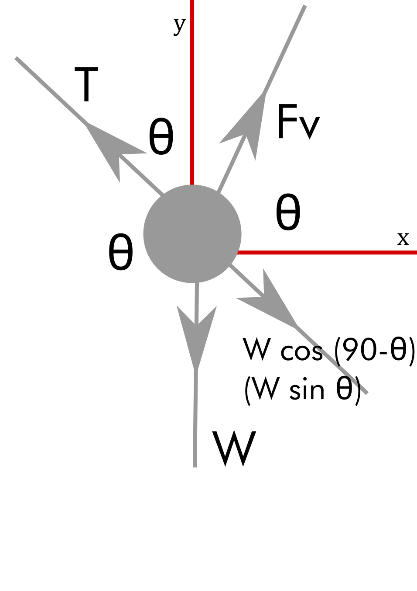

# Ujian kelompok 5


## Anggota
Terdapat enam orang anggota pada kelompok 5 ini dengan fraksi kontribusinya pada pengerjaan tiap soal dapat dilihat dalam tabel berikut.

| NIM      | Nama                  | Peran pada soal (dan fraksi kontribusinya)   |
|----------|-----------------------|----------------------------------------------|
|          |                       |                                              |
| 10217010 | Panglima Einstein III | 1 (0.10) 2 (0.00) 3 (0.20) 4 (0.30) 5 (0.16) |
| 10250098 | Teman Maxwell Jr.     | 1 (0.20) 2 (0.00) 3 (0.20) 4 (0.30) 5 (0.17) |
| 10250123 | Densitas Kanonika     | 1 (0.10) 2 (0.00) 3 (0.20) 4 (0.30) 5 (0.16) |
| 10250199 | Dualisma Singulariadi | 1 (0.20) 2 (0.00) 3 (0.00) 4 (0.10) 5 (0.17) |
| 10250201 | Antrodinamika Laten   | 1 (0.20) 2 (0.50) 3 (0.20) 4 (0.00) 5 (0.17) |
| 10250278 | Ergodik Kekal Tunak   | 1 (0.20) 2 (0.50) 3 (0.20) 4 (0.00) 5 (0.17) |
|          |                       |                                              |
|          | Total                 | 1 (1.00) 2 (1.00) 3 (1.00) 4 (1.00) 5 (1.00) |


# Jawaban

## Soal 1 | Sistem bandul dengan sistem koordinat kartesian


### a
Jawaban berikut akan lebih jelas dilihat dalam [editor](https://rawcdn.githack.com/dudung/jsxphys/4220729be109df8b94729ca4605562caa6d7596b/0.0.2/editor.html).

		\item
		 Didapat persamaan dalam setiap arah gerak bandul sebagai berikut, untuk gerak  sumbu $x$:
		\begin{equation}
		\Sigma F_x = m \ddot{x}
		\end{equation}
		Pertama-tama, dengan melihat gambar dapat ditemukan hubungan
		\begin{equation}
		T \cos \theta -F_{visko_x}= m \ddot{x}
		\end{equation}
		Jika dianalisa gaya searah $\hat{r}$,
		\begin{equation}
		T -\omega sin  \theta= \dfrac{mv^2}{l}
		\end{equation}
		sehingga
		\begin{equation}
		T =\omega sin  \theta + \dfrac{mv^2}{l}
		\end{equation}
		dan
		\begin{equation}
		F_{visko_x}= 3\eta\pi D\ddot{x}.
		\end{equation}
		Jika disubstitusikan,
		\begin{equation}
		-mg \cos\theta \sin\theta+\dfrac{mv^2}{l}cos\theta - 3\pi\eta D \dot{x} -  =m \ddot{x}
		\end{equation}
		Substitusikan persamaan $\cos \theta =\dfrac{x}{l} $ , $\sin \theta =\dfrac{y}{l} $, dan $ w =-mg$, \textbf{sehingga akan didapat}
		\begin{equation}
		\ddot{x} +\dfrac{gxy}{l^2} + \dfrac{3\pi\eta D \dot{x}}{m} -\dfrac{v^2}{l^2}x =0 
		\end{equation} \\
		
		Selanjutnya, akan diturunkan persamaan gerak untuk sumbu y. 
		\begin{equation}
		\Sigma F_y = m \ddot{y}
		\end{equation}
		Dengan melihat gambar, dapat dilihat gaya yang bekerja di sumbu y adalah
		\begin{equation}
		T \sin\theta -mg - F_{visko_y} =m\ddot{y}
		\end{equation}
		Substitusikan persamaan $	F_{visko_y}= 3\eta\pi D\ddot{y}	$ dan $\sin \theta =\dfrac{y}{l} $, \textbf{sehingga akan didapat}
		\begin{equation}
		\ddot{y} + \dfrac{3\pi\eta D}{m} \dot{y} + \dfrac {({\dot{x^2}+\dot{y^2}})y}{l^2} -\dfrac{gy^2}{l^2} = -g
		\end{equation}

### b Jawaban berikut akan lebih jelas dilihat dalam [editor](https://rawcdn.githack.com/dudung/jsxphys/4220729be109df8b94729ca4605562caa6d7596b/0.0.2/editor.html).
		\item Untuk persamaan gaya di sumbu x, 
		\begin{equation}
		\dfrac{g}{l^2}xy - \dfrac{3\pi\eta D}{m} \dot{x} - \dfrac{(\dot{x^2}+\dot{y^2})}{l^2}x =\ddot{x}
		\end{equation} \\
		terdapat suku $\ddot{x}$ sebagai \textbf{komponen percepatan},$ \dfrac{3\pi\eta D}{m} \dot{x} $ sebagai \textbf{komponen gaya gesek menggunakan hukum Stokes}, $-\dfrac{(\dot{x^2}+\dot{y^2})}{l^2}x$ sebagai \textbf{komponen gaya sentripetal untuk tegangan tali}, dan $\dfrac{g}{l^2}xy$ adalah \textbf{komponen gaya gravitasi di tegangan tali}.
		
		Untuk persamaan gaya di sumbu y, 
		\begin{equation}
		\ddot{y} + \dfrac{3\pi\eta D}{m} \dot{y} + \dfrac {({\dot{x^2}+\dot{y^2}})y}{l^2} -\dfrac{gy^2}{l^2} = -g
		\end{equation}
		terdapat suku $\ddot{y}$ sebagai \textbf{komponen percepatan},$ \dfrac{3\pi\eta D}{m} \dot{y} $ sebagai \textbf{komponen gaya gesek menggunakan hukum Stokes}, $-\dfrac{(\dot{x^2}+\dot{y^2})}{l^2}y$ sebagai \textbf{komponen gaya sentripetal untuk tegangan tali}, dan $\dfrac{gy^2}{l^2}$ adalah \textbf{komponen gaya gravitasi di tegangan tali}. Selain itu, terdapat juga \textbf{komponen $-g$ sebagai komponen gravitasi (vertikal sumbu y)}.

### c


## Soal 2 | Bandul dengan sistem koordinat polar

### a

### b

### c

### d
Kode program berikut

```C++
/*
	NamaProgram.cpp
	
	Menghitung sesuatu
*/

int main(int argc, char *argv[]) {
}
```

dapat dijalankan secara daring menggunakan [http://cpp.sh/](http://cpp.sh/) atau aplikasi lainnya.

## Soal 3 | Jaringan saraf tiruan dengan aplikasi TensorFlow

### a

### b

### c

### d


## Soal 4 | Algoritma genetik sederhana dengan JS

### a
Fungsi yang dimaksud adalah

```JavaScript
// Get interpretation of position and group from chromosome
function getValues() {
	var p = arguments[0];
	
	var xs = p.slice(0, 3);
	var ys = p.slice(3, 6);
	var gs = p.slice(6);
	
	var x = -1;
	var y = -1;
	var g = -1;
	
	/*
	x = xs;
	y = ys;
	g = gs;
	*/
	
	return [x, y, g];
}
```

dengan .. (penjelasannya).

### b

### c

### d


## Soal 5 | Research based learning

### a Tujuan

### b Rumusan masalah

### c Metode

### d Hasil dan diskusi

### e Referensi
1. Penulis, "Judul", Website, ..
2. Penulis, "Judul", Journal, vol. no., pp. Bulan Tahun, DOI ..
