# UAS FISKOM FI3201 Kelompok 05


## Anggota
Terdapat enam orang anggota pada kelompok 5 ini dengan fraksi kontribusinya pada pengerjaan tiap soal dapat dilihat dalam tabel berikut.
| NIM      | Nama                  | Peran pada soal (dan fraksi kontribusinya)   |
|----------|-----------------------|----------------------------------------------|
|          |                       |                                              |
| 10217023 | Muhammad Nauval FR    | 1 (0.16) 2 (0.16) 3 (0.16) 4 (0.16) 5 (0.17) |
| 10217027 | Awla Fajri Assalam    | 1 (0.16) 2 (0.16) 3 (0.16) 4 (0.17) 5 (0.17) |
| 10217038 | Steffan Rafly Tanasia | 1 (0.16) 2 (0.16) 3 (0.16) 4 (0.16) 5 (0.16) |
| 10217042 | Humam                 | 1 (0.16) 2 (0.16) 3 (0.16) 4 (0.17) 5 (0.17) |
| 10217045 | Hans Marvin Tanuardi  | 1 (0.10) 2 (0.16) 3 (0.16) 4 (0.16) 5 (0.16) |
| 10217088 | Wilbert Irwan         | 1 (0.16) 2 (0.16) 3 (0.17) 4 (0.10) 5 (0.17) |
|          |                       |                                              |
|          | Total                 | 1 (1.00) 2 (1.00) 3 (1.00) 4 (1.00) 5 (1.00) |


# Jawaban

## Soal 1 | Sistem bandul dengan sistem koordinat kartesian


### a
Jawaban berikut akan lebih jelas dilihat dalam [editor](https://rawcdn.githack.com/dudung/jsxphys/4220729be109df8b94729ca4605562caa6d7596b/0.0.2/editor.html).


		Didapat persamaan dalam setiap arah gerak bandul sebagai berikut, untuk gerak  sumbu $x$:
		\begin{equation}
		\Sigma F_x = m \ddot{x}
		\end{equation}
		Pertama-tama, dengan melihat gambar dapat ditemukan hubungan
		\begin{equation}
		T \cos \theta -F_{visko_x}= m \ddot{x}
		\end{equation}
		Jika dianalisa gaya searah $\hat{r}$,
		\begin{equation}
		T -\omega sin  \theta= \dfrac{mv^2}{l}
		\end{equation}
		sehingga
		\begin{equation}
		T =\omega sin  \theta + \dfrac{mv^2}{l}
		\end{equation}
		dan
		\begin{equation}
		F_{visko_x}= 3\eta\pi D\ddot{x}.
		\end{equation}
		Jika disubstitusikan,
		\begin{equation}
		-mg \cos\theta \sin\theta+\dfrac{mv^2}{l}cos\theta - 3\pi\eta D \dot{x} -  =m \ddot{x}
		\end{equation}
		Substitusikan persamaan $\cos \theta =\dfrac{x}{l} $ , $\sin \theta =\dfrac{y}{l} $, dan $ w =-mg$, 
		sehingga akan didapat
		\begin{equation}
		\ddot{x} +\dfrac{gxy}{l^2} + \dfrac{3\pi\eta D \dot{x}}{m} -\dfrac{v^2}{l^2}x =0 
		\end{equation} 
		
		Selanjutnya, akan diturunkan persamaan gerak untuk sumbu y. 
		\begin{equation}
		\Sigma F_y = m \ddot{y}
		\end{equation}
		Dengan melihat gambar, dapat dilihat gaya yang bekerja di sumbu y adalah
		\begin{equation}
		T \sin\theta -mg - F_{visko_y} =m\ddot{y}
		\end{equation}
		Substitusikan persamaan $F_{visko_y}= 3\eta\pi D\ddot{y}$ dan $\sin \theta =\dfrac{y}{l} $, 
		sehingga akan didapat
		\begin{equation}
		\ddot{y} + \dfrac{3\pi\eta D}{m} \dot{y} + \dfrac {({\dot{x^2}+\dot{y^2}})y}{l^2} -\dfrac{gy^2}{l^2} = -g
		\end{equation}

### b 
Jawaban berikut akan lebih jelas dilihat dalam [editor](https://rawcdn.githack.com/dudung/jsxphys/4220729be109df8b94729ca4605562caa6d7596b/0.0.2/editor.html).

		Untuk persamaan gaya di sumbu x, 
		\begin{equation}
		\dfrac{g}{l^2}xy - \dfrac{3\pi\eta D}{m} \dot{x} - \dfrac{(\dot{x^2}+\dot{y^2})}{l^2}x =\ddot{x}
		\end{equation}
		terdapat suku $\ddot{x}$ sebagai komponen percepatan,,$ \dfrac{3\pi\eta D}{m} \dot{x} $ 
		sebagai komponen gaya gesek menggunakan hukum Stokes, 
		$-\dfrac{(\dot{x^2}+\dot{y^2})}{l^2}x$ sebagai komponen gaya sentripetal untuk tegangan tali, 
		dan $\dfrac{g}{l^2}xy$ adalah komponen gaya gravitasi di tegangan tali.		
		Untuk persamaan gaya di sumbu y, 
		\begin{equation}
		\ddot{y} + \dfrac{3\pi\eta D}{m} \dot{y} + \dfrac {({\dot{x^2}+\dot{y^2}})y}{l^2} -\dfrac{gy^2}{l^2} = -g
		\end{equation}
		terdapat suku $\ddot{y}$ sebagai komponen percepatan,$ \dfrac{3\pi\eta D}{m} \dot{y} $ 
		sebagai komponen gaya gesek menggunakan hukum Stokes, 
		$-\dfrac{(\dot{x^2}+\dot{y^2})}{l^2}y$ sebagai komponen gaya sentripetal untuk tegangan tali, 
		dan $\dfrac{gy^2}{l^2}$ adalah komponen gaya gravitasi di tegangan tali. 
		Selain itu, terdapat juga komponen $-g$ sebagai komponen gravitasi (vertikal sumbu y).

### c
Jawaban berikut akan lebih jelas dilihat dalam [editor](https://rawcdn.githack.com/dudung/jsxphys/4220729be109df8b94729ca4605562caa6d7596b/0.0.2/editor.html).

		Untuk benda jatuh bebas tanpa gesekan udara,  maka persamaan (2) (gaya di sumbu x)  berubah menjadi 
		\begin{equation}
		\ddot{x} = 0
		\end{equation}
		Persamaan (3) (gaya di sumbu y)  berubah menjadi 
		\begin{equation}
		\ddot{y} = -g
		\end{equation}
		Saat gaya jatuh bebas tanpa ada gesekan, komponen tegangan dan viskositas bisa diabaikan, 
		sehingga $\eta =0$ dan $ l \approx \infty$.
### d
Jawaban berikut akan lebih jelas dilihat dalam [editor](https://rawcdn.githack.com/dudung/jsxphys/4220729be109df8b94729ca4605562caa6d7596b/0.0.2/editor.html).

		Untuk simpangan kecil, maka $\dfrac{y}{l} \approx 1$ dan $\dfrac{x}{l} \approx \theta$. 
		Tanpa gaya gesek, maka $\eta =0$.
		Sehingga, didapat 
		\begin{equation}
		\ddot{x} - \dfrac{(\dot{x^2}+\dot{y^2})}{l}\theta + g\theta =0
		\end{equation}
		\begin{equation}
		\ddot{y} - \dfrac{(\dot{x^2}+\dot{y^2})}{l}\theta + g =-g
		\end{equation}
## Soal 2 | Bandul dengan sistem koordinat polar

### a 
Jawaban berikut akan lebih jelas dilihat dalam [editor](https://rawcdn.githack.com/dudung/jsxphys/4220729be109df8b94729ca4605562caa6d7596b/0.0.2/editor.html).

			Pertama diketahui posisi bandul sebagai berikut:
			T adalah gaya tegang tali, Fv adalah gaya viskositas akibat udara, dan W adalah berat.\\
			Persamaan gerak pada sumbu $\hat{\theta}$ dapat diturunkan 
			dengan mengingat $\alpha = \dfrac{d^2\theta}{dt^2} =\dfrac{M}{I}$, 
			dimana $\alpha$ adalah momentum sudut, M adalah momen, dan I adalah inersia.
			
			Torsi ditentukan oleh proyeksi gaya ke arah tangensial:
			\begin{equation}
			M = -mgL\sin \theta
			\end{equation} 
			Momen inersia pendulum adalah momen inersia lingkaran:
			\begin{equation}
			I = mL^2
			\end{equation} 
			Sehingga, persamaan gerak di sumbu $\hat{\theta}$ adalah, 
			dengan mencoret suku-suku yang sama:
			\begin{equation}
			\dfrac{d^2\theta}{dt^2} = \dfrac {M}{I} =\dfrac{g \sin\theta}{L} 
			\end{equation} 
			\begin{equation}
			\dfrac{d^2\theta}{dt^2} +  \dfrac{g  \sin\theta}{L}  =0
			\end{equation} 
			
			Untuk persamaan gerak pada sumbu $ \hat{r}$, berlaku
			\begin{equation}
			w \cos \theta +T = \dfrac{mv^2}{r} + m\dot{\theta^2}R
			\end{equation}
			\begin{equation}
			-mg \cos \theta +T = m \dot{\theta^2}l
			\end{equation} 
			\begin{equation}
			 \dot{\theta^2}+\dfrac{g}{l} \cos \theta =\dfrac{T}{ml}
			\end{equation} 
### b 
Jawaban berikut akan lebih jelas dilihat dalam [editor](https://rawcdn.githack.com/dudung/jsxphys/4220729be109df8b94729ca4605562caa6d7596b/0.0.2/editor.html).
Hasil dari perhitungan menggunakan metode analitik digrafikkan di https://plotly.com/~Avestory/3/#/
			
			\begin{equation}
			\dfrac{d^2\theta}{dt^2} - \dfrac{g\theta}{l} =0 
			\end{equation} 
			Persamaan diferensial ini adalah persamaan diferensial karakteristik, 
			sehingga dengan memisalkan $\lambda_{12} = \pm \sqrt{\dfrac{g}{l}}i$, sehingga:
			\begin{equation}
			\theta = C\exp{\lambda_1t}+D\exp{\lambda_2t}
			\end{equation} 
			\begin{equation}
			\theta = C (\cos \sqrt{\dfrac{g}{l}}t + i \sin \sqrt{\dfrac{g}{l}}t) +
			D(\cos \sqrt{\dfrac{g}{l}}t - i \sin \sqrt{\dfrac{g}{l}}t)
			\end{equation} 
			\begin{equation}
			\theta = (C+D) \cos \sqrt{\dfrac{g}{l}}t +  i (C-D) \sin \sqrt{\dfrac{g}{l}}t
			\end{equation} 		
			\begin{equation}
			\theta = A \cos \sqrt{\dfrac{g}{l}}t +   B \sin \sqrt{\dfrac{g}{l}}
			\end{equation} 	
			Saat t = 0, asumsikan bandul berada di amplitudo ($\theta_{max}$) sehingga sudut maksimum.
			\begin{equation}
			\theta_{max} = A \cos 0 + 0 \Rightarrow \theta_{max} = A
			\end{equation} 	
			Didapat A = amplitudo, B  = 0.
			Sehingga, pada akhirnya akan didapat 
			\begin{equation}
			\theta = A \cos  \sqrt{\dfrac{g}{l}}t, \\ \dot{\theta} =-\sqrt{\dfrac{g}{l}} A \sin \sqrt{\dfrac{g}{l}}t
			\end{equation} 	
			Untuk persamaan kedua, dengan mensubstitusikan persamaan sebelumnya,
			\begin{equation}
			\dot{\theta^2} + \dfrac{g}{l}cos\theta = \dfrac{T}{lm}
			\end{equation} 
			Karena menggunakan pendekatan sudut kecil, maka	
			\begin{equation}
			T \approx \left((\sqrt{\dfrac{g}{l}}A\sin \sqrt{\dfrac{g}{l}}t)^2 +\sqrt{\dfrac{g}{l}}\cos\theta\right)lm
			\end{equation} 	
			\begin{equation}
			T \approx A^2 g \sin^2 (\sqrt{\dfrac{g}{l}}t) +m\sqrt{gl}  \cos \theta
			\end{equation} 
			
			
	
			
### c 
Jawaban berikut akan lebih jelas dilihat dalam [editor](https://rawcdn.githack.com/dudung/jsxphys/4220729be109df8b94729ca4605562caa6d7596b/0.0.2/editor.html).Hasil dari perhitungan menggunakan metode numerik digrafikkan di https://plotly.com/~Avestory/1/#/ 

		
			Dengan metode Euler,
			\begin{equation}
			\dfrac{df}{dx}= \dfrac{f(x+L)-f(x)}{h} \Rightarrow \dfrac{f^{i+1}-f^i}{\Delta x}
			\end{equation}
			Persamaan $\ddot{\theta}$ dan $\dot{\theta}$ dapat dirubah menjadi
			\begin{equation}
			\dot{\theta}=\dfrac{d\theta}{dt}=  
			\dfrac{\theta^{i+1}-\theta^i}{\Delta t} \Rightarrow \theta^{i+1} = \dot{\theta}^i\Delta t+ \theta^i
			\end{equation}
			dan
			\begin{equation}
			\ddot{\theta}=\dfrac{g}{l} \sin \theta \Rightarrow  \dfrac{d\dot{\theta}^i}{dt} =  \dfrac{g}{l} \sin \theta
			\end{equation}
			\begin{equation}
			 \dfrac{\dot{\theta}^{i+1}-\dot{\theta}^i}{\Delta t} = \dfrac{g}{l} \sin \theta^{i} 
			\end{equation}
			\begin{equation}
			\theta^{i+1}=\dfrac{g}{l} \sin \dot{\theta}^{i}\Delta t+\dot{\theta}^i 
			\end{equation}
### d
Untuk menyelesaikan secara numerik, dibuat kode di C++ sebagai berikut:

```C++
/*
	kodeno2d.cpp
	
	Menghitung solusi PDB menggunakan metode numerik
*/

			#include <iostream>
			#include <cmath>
			#include <fstream>
			
			using namespace std;
			
			int main(){
			/* variabel yang digunakan */
			float g,l,h,m,tt;
			int i,n;
			
			g = 9.82;
			
			/*besar panjang tali*/
			l=1;
			/*besar massa*/
			m=0.5;
			/*total waktu analisis*/
			tt = 10;
			/*step waktu yang digunakan*/
			h = 0.1;
			
			n = tt/h;
			float theta[n],thetadot[n],f[n],T[n],t[n];
			
			for (i=0;i<n;i++){
			t[i] = 0;
			f[i] = 0;
			T[i] = 0;
			theta[i] = 0;
			thetadot[i] = 0;
			}
			
			/* pendefinisian awal */
			theta[0] = 30*3.14/180;
			thetadot[0] = 0;
			
			/* logika euler dan input data yang didapat ke file theta.txt */
			ofstream myfile;
			myfile.open ("theta.txt");
			for (i=0; i<=n; i++){
			theta[i+1] = theta[i] + thetadot[i]*h;
			f[i] = (g/l)*sin(theta[i+1])*-1;
			thetadot[i+1] = thetadot[i] + f[i]*h;
			T[i] = l*m*(thetadot[i]*thetadot[i] + g*cos(theta[i])/l);
			
			t[i+1] = t[i] + h;
			
			myfile <<  t[i]  << "  "  << theta[i] << "  " << thetadot[i] << "  " << T[i] << "\n";
			
			cout << "t[" << i << "]: " << t[i] << "\n";
			cout << "theta[" << i << "]: " << theta[i] << "\n";
			cout << "thetadot[" << i << "]: " << thetadot[i] << "\n";
			cout << "T[" << i << "]: " << T[i] << "\n" << "\n";
			}
			myfile.close();
			
			
			/* terminasi program */
			return 0;
}
```

Kode ini dapat dijalankan secara daring di cpp.sh/2ybae. Kode juga tersedia di repository GitHub ini di https://github.com/mnauvalfr/uasfiskom/blob/master/kodeno2d.cpp

## Soal 3 | Jaringan saraf tiruan dengan aplikasi TensorFlow

### a
Dalam proses penyelesaian masalah, dataset yang telah diberikan dimasukkan terlebih dahulu ke dalam perangkat lunak Microsoft Excel untuk dianalisa bentuk persebaran datanya. Untuk tabel data pertama, terdapat persebaran data seperti berikut.\
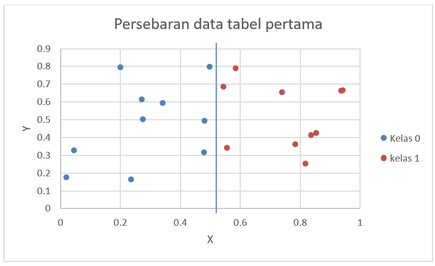

Berdasarkan persebaran data yang terdapat di tabel di atas, terlihat jelas bahwa data dapat dipisahkan dengan metode perceptron. Dengan data yang telah didapatkan, dilakukan uji coba di laman daring Artificial Neural Network Playground yang disediakan oleh Tensorflow. Ketentuan dan batasan uji coba yang terdapat adalah sebagai berikut. \
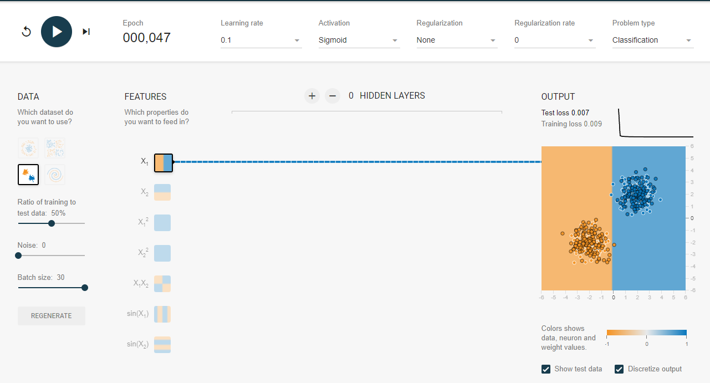

\Berdasarkan data persebaran yang ada, dataset yang paling mirip dengan persebaran yang sudah dirumuskan adalah dataset yang dipilih. Ditentukan hanya satu neuron input karena dataset yang perlu dianalisa memiliki dua fitur di mana hanya satu fitur yang berkontribusi terhadap pembagian kelas (N1=1). Hidden layer tidak digunakan pada uji coba ini karena berdasarkan persebaran data, data dapat dipisah menggunakan linear boundary. Tanpa hidden layer yang mengandung satu neuron, dapat dilihat bahwa hanya dalam 47 iterasi (epoch), data sudah secara rapi terpisah. Sehingga, arsitektur yang digunakan pada dataset ini adalah 1-0-1.
### b
Dalam proses penyelesaian masalah, dataset yang telah diberikan dimasukkan terlebih dahulu ke dalam perangkat lunak Microsoft Excel untuk dianalisa bentuk persebaran datanya. Untuk tabel data pertama, terdapat persebaran data seperti berikut.\
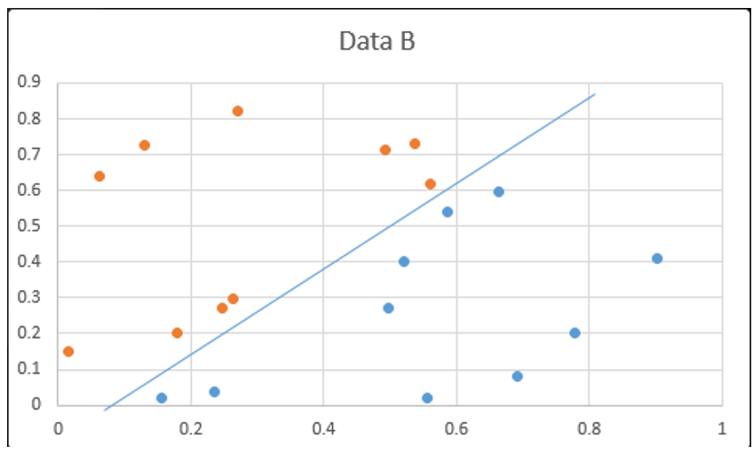	

Berdasarkan persebaran data yang terdapat di tabel di atas, terlihat jelas bahwa data dapat dipisahkan dengan metode perceptron. Dengan data yang telah didapatkan, dilakukan uji coba di laman daring Artificial Neural Network Playground yang disediakan oleh Tensorflow. Ketentuan dan batasan uji coba yang terdapat adalah sebagai berikut.\
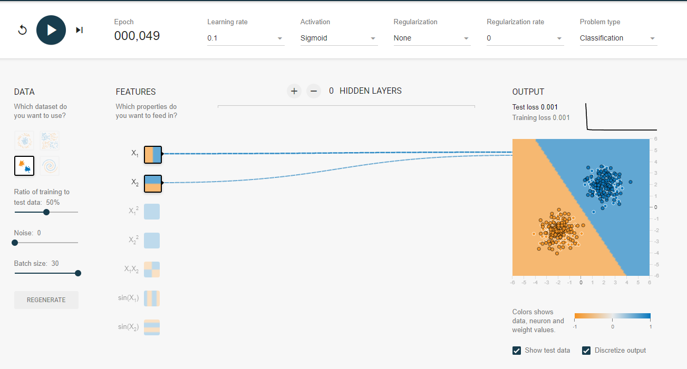	

Berdasarkan data persebaran yang ada, dataset yang paling mirip dengan persebaran yang sudah dirumuskan adalah dataset yang dipilih. Ditentukan dua neuron input karena dataset yang perlu dianalisa memiliki dua fitur (N1=2). Hidden layer tidak digunakan pada uji coba ini karena berdasarkan persebaran data, data dapat dipisah menggunakan linear boundary. Tanpa hidden layer yang mengandung satu neuron, dapat dilihat bahwa hanya dalam 49 iterasi (epoch), data sudah secara rapi terpisah. Sehingga, arsitektur yang digunakan pada dataset ini adalah 2-0-1.
### c
Untuk penentuan JST, akan lebih mudah jika terlebih dahulu divisualisasikan. Pertama, data yang diperoleh dimasukkan pada perangkat lunak Excel dan diurutkan outputnya agar terpisah data yang memberikan output kelas 0 dan 1. Kemudian, dibuat diagram scatter dengan warna output 1 dan 0 berbeda dengan Excel dan ditarik garis boundary layer agar bisa ditentukan berapa boundary layer yang dibutuhkan.\
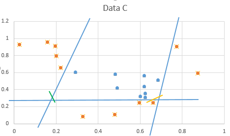		

Dari gambar ini terlihat garis memiliki kemiringan artinya sumbu x dan sumbu y keduanya ikut berpengaruh terhadap hasil. Sehingga, bisa disimpulkan bahwa layer input yang digunakan adalah 2 yaitu fitur x dan y (N1=2).
Dari gambar terlihat dibutuhkan minimal 3 boundary layer, jumlah boundary setara dengan jumlah neuron yang dibutuhkan hidden layer sehingga untuk hidden layer N2 dibutuhkan minimal 3 neuron untuk memisahkan. Agar training lebih cepat, untuk hidden layer N2, neuron dapat ditambah satu untuk menghaluskan boundary seperti diberikan oleh garis kuning sedangkan garis hijau diwakili oleh output layer. Tetapi, untuk kesederhanaan ANN maka sebenarnya cukup digunakan tiga neuron pada satu hidden layer (N2=3).
Dari gambar, terlihat bahwa output yang diharapkan adalah pemisah yaitu 1 dan 0 sehingga bentuk output layer hanya memisahkan 2 data diskrit. Maka, output layer hanya memerlukan 1 yaitu pemisah 1 dan 0 (N3 = 1).Didapat N1 - N2 - N3 = 2 – 3 – 1.
### d
Penjelasan sebenarnya sudah dijelaskan dari 3.a hingga 3.c., didapatkan dari visualisasi dataset pertama bahwa data terpisah secara jelas oleh satu garis sehingga diperlukan dua neuron input untuk dua fitur x dan y dan karena pemisah linear, maka tidak diperlukan hidden layer. Untuk dataset kedua, dipisahkan oleh garis miring sehingga kedua sumbu x dan y berpengaruh sehingga diperlukan dua neuron input. Tetapi, karena masih bisa dipisahkan boundary linear maka tidak dimerlukan hidden layer. Sedangkan, untuk data C, diperlukan dua input dan pemisah harus diwakili oleh 3 boundary sehingga diperlukan satu hidden layer dengan tiga neuron.
Arsitektur JST yang sederhana penting karena semakin rumit arsitektur maka iterasi yang dilakukan semakin lama dan panjang serta resource yang diperlukan juga meningkat. Kita harus seefisien mungkin dalam mengalokasikan computational resource terutama jika yang akan diolah data yang besar.

## Soal 4 | Algoritma genetik sederhana dengan JS
### a
Fungsi yang dimaksud adalah

```JavaScript
	main();
		// Define main function
		function main() {
		var p = "0010110";
		[xs, ys, cs] = getValues(p);
		console.log("p =",p);
		console.log("x =",xs);
		console.log("y =",ys);
		console.log("c =",cs);
		}
		function getValues() {
		var p = arguments[0];
		var xs = p.slice(0, 3);
		var ys = p.slice(3, 6);
		var cs = p.slice(6);
		
		return [xs, ys, cs];
		}
}
```

dengan input kromoson 0010110. Hasilnya adalah

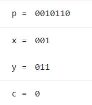

Kode ini dapat dijalankan secara daring menggunakan [jsconsole.com](jsconsole.com) atau aplikasi lainnya. Kode juga tersedia di GitHub berupa file .txt terpisah yang dapat dicompile di jsconsole.com (https://github.com/mnauvalfr/uasfiskom/blob/master/4a.txt)
### b
Kode ini dibuat dengan nilai x0 = 111 dan y0 = 111:
```JavaScript
main();
// Define main function
function main() {
    var p = "1010110";
    [xs, ys, cs] = getValues(p);
    var hasil = 1/(1+fitness(xs,ys));			//fungsi utuh fitting
    console.log("p =",p);
    console.log("x =",xs);
    console.log("y =",ys);
    console.log("c =",cs);
    console.log("hasil = ",hasil);
}

function getValues() {
    var p = arguments[0];
    var xs = p.slice(0, 3);
    var ys = p.slice(3, 6);
    var cs = p.slice(6);
    return [xs, ys, cs];
}

function fitness(a, b) {			//fungsi untuk fitting (hanya bagian akar)
  return(Math.sqrt(Math.pow((a - 111), 2) + Math.pow((b - 111),2)));
}

```
Kode ini dapat dijalankan secara daring menggunakan [jsconsole.com](jsconsole.com) atau aplikasi lainnya. Kode juga tersedia di GitHub berupa file .txt terpisah yang dapat dicompile di jsconsole.com (https://github.com/mnauvalfr/uasfiskom/blob/master/4b.txt)
### c
Kode ini dibuat dengan nilai x0 = 111 dan y0 = 111:

```JavaScript
main();
//
// Define main function 
function main() 
{ var p = "1010110";
  var q = "1011111";
  var r = "1111011";
  var s = "1110110";
  var t = "1111101";
  var threshold= 0.5;
[x1, y1, c1] = getValues(p); 
[x2, y2, c2] = getValues(q); 
[x3, y3, c3] = getValues(r); 
[x4, y4, c4] = getValues(s); 
[x5, y5, c5] = getValues(t); 
var hasil1 = 1/(1+fitness(x1,y1));
var seleksi1 = selection(threshold, hasil1, p)
console.log("p =",p); 
console.log("x =",x1); 
console.log("y =",y1); 
console.log("c =",c1);
console.log("hasil = ",hasil1);
console.log("seleksi = ",p," ",  seleksi1);
var hasil2 = 1/(1+fitness(x2,y2));
var seleksi2 = selection(threshold, hasil2, q)
console.log("q =",q); 
console.log("x =",x2); 
console.log("y =",y2); 
console.log("c =",c2); 
console.log("hasil = ",hasil2);
console.log("seleksi = ",q," ",  seleksi2);
var hasil3 = 1/(1+fitness(x3,y3));
var seleksi3 = selection(threshold, hasil3, r)
console.log("r =",r); 
console.log("x =",x3); 
console.log("y =",y3); 
console.log("c =",c3); 
console.log("hasil = ",hasil3);
console.log("seleksi = ",r," ",  seleksi3);
var hasil4 = 1/(1+fitness(x4,y4));
var seleksi4 = selection(threshold, hasil4, s)
console.log("s =",s); 
console.log("x =",x4); 
console.log("y =",y4); 
console.log("c =",c4); 
console.log("hasil = ",hasil4);
console.log("seleksi = ",s," ", seleksi4);
var hasil5 = 1/(1+fitness(x5,y5));
var seleksi5 = selection(threshold, hasil5, t)
console.log("t =",t); 
console.log("x =",x5); 
console.log("y =",y5); 
console.log("c =",c5); 
console.log("hasil = ",hasil5);
console.log("seleksi = ",t," ", seleksi5);
}

function getValues() 
{ var p = arguments[0];
var xs = p.slice(0, 3); 
var ys = p.slice(3, 6); 
var cs = p.slice(6);
return [xs, ys, cs]; 
}
function fitness(a, b) 
{ return(Math.sqrt(Math.pow((a - 111), 2) + Math.pow((b - 111),2))); 
}

function selection(threshold, a, p)
{ if (a>=threshold) { result="pass the selection";
} else { result="didnt pass the selection";
}
return (result);
}
```
Kode ini dapat dijalankan secara daring menggunakan [jsconsole.com](jsconsole.com) atau aplikasi lainnya.
Kode juga tersedia di GitHub berupa file .txt terpisah yang dapat dicompile di jsconsole.com (https://github.com/mnauvalfr/uasfiskom/blob/master/4c.txt)
Hasil yang didapat adalah sebagai berikut:

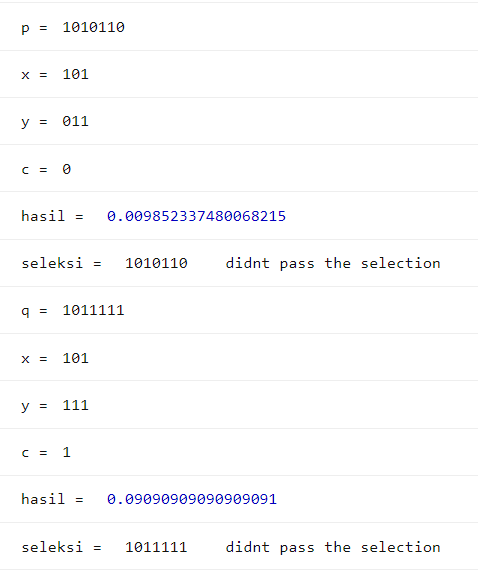

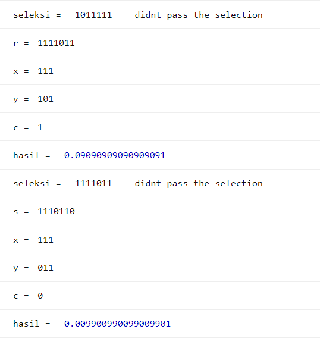

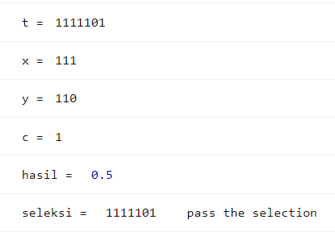

### d
Kode ini sama dengan kode untuk 4b, namun masukannya diganti menjadi x0 =101 dan y0 = 100:
```JavaScript
main();

// Define main function
function main() {
    var p = "1011001";    //input kromoson yang diuji
    [xs, ys, cs] = getValues(p);
    var hasil = 1/(1+fitness(xs,ys));
    console.log("p =",p);
    console.log("x =",xs);
    console.log("y =",ys);
    console.log("c =",cs);
    console.log("hasil = ",hasil);

}

function getValues() {
    var p = arguments[0];

    var xs = p.slice(0, 3);
    var ys = p.slice(3, 6);
    var cs = p.slice(6);

    return [xs, ys, cs];
}

function fitness(a, b) {
  return(Math.sqrt(Math.pow((a - 101), 2) + Math.pow((b - 100),2)));	//ganti nilai dalam akar untuk kromoson referensi
}

```
Kode ini dapat dijalankan secara daring menggunakan [jsconsole.com](jsconsole.com) atau aplikasi lainnya.
Kromosom yang akan dicek, beserta hasilnya, adalah sebagai berikut
#### a 1111011 , x = 111 dan y = 101

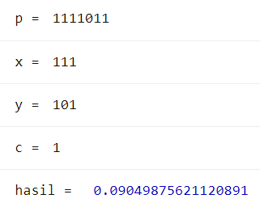

#### b 1001111 , x = 100 dan y = 111

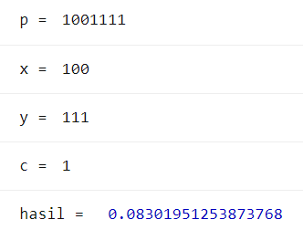

#### c 1001001, x = 100 dan y = 100

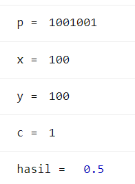

#### d 1111111, x = 111 dan y = 111

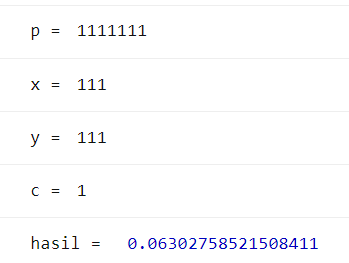

#### e 1011001, x = 101 dan y = 100


Hasil maksimal yang diperoleh adalah kromoson 1011001 karena sama dengan kromoson threshold dengan fitness 1 dan kromoson yang paling mendekati 1011001 adalah kromoson 1001001 dengan nilai fitness 0,5 dari 5 iterasi yang dicoba. Kode juga tersedia di GitHub berupa file .txt terpisah yang dapat dicompile di jsconsole.com (https://github.com/mnauvalfr/uasfiskom/blob/master/4d.txt)


## Soal 5 | Research based learning

### a Tujuan
Salah satu pemanfaatan terbaik untuk fisika komputasi adalah dalam analisis desain dan data reaktor nuklit
Tujuan dari analisis desain dan data nuklir adalah menentukan performa sebuah reaktor nuklir ,yang ditentukan oleh beberapa variabel. Dalam RBL ini, yang dibahas hanya dua, yaitu fluks sumber neutron dan daya reaktor.


### b Rumusan masalah

-Bagaimana grafik distribusi flux neutron suatu sumber reaktor silinder?

-Berapa daya yang dihasilkan reaktor?

### c Usulan metode

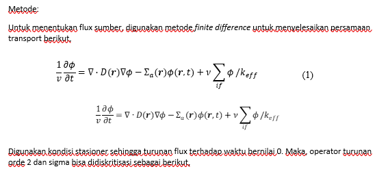

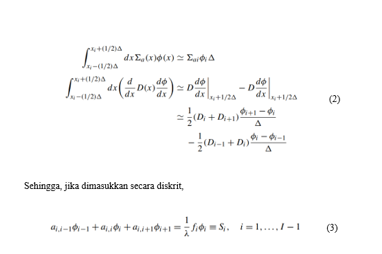

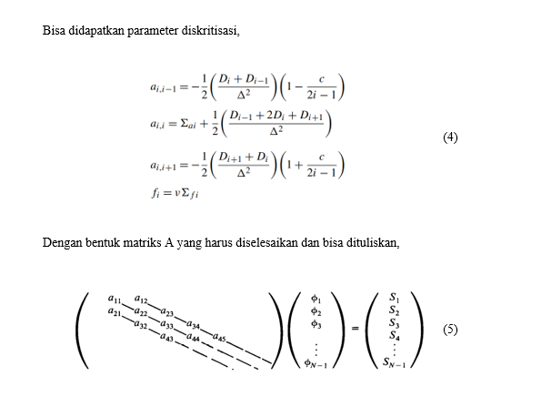

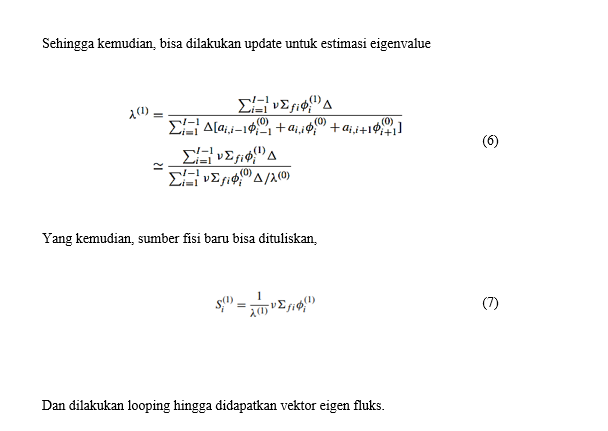

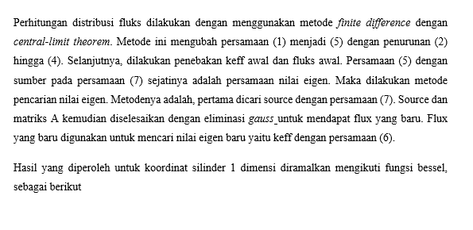

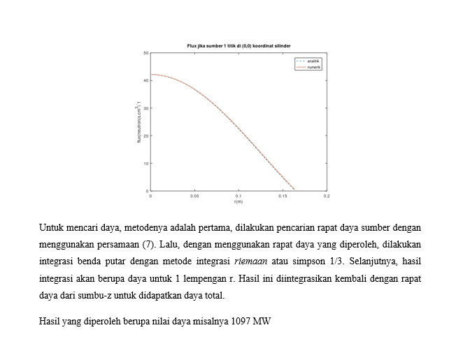

### d Prakiraan hasil dan analisis
Hasil dari pencarian fluks adalah distribusi fluks, Keff (koefisien pengali neutorn efektif) awal, dan fluks awal. Perhitungan fluks sangat penting untuk menentukan performa reaktor nuklir, salah satunya adalah daya. Flux yang dihasilkan akan turun mengikuti fungsi bessel. 
Sementara itu, hasil perhitungan daya adalah nilai numerik.
### e Referensi
1.Ding, Zechuan.(2018). Solving Bateman Equation for Xenon Transient Analysis Using Numerical Methods.

2. Duderstadt, J. and Hamilton, L. (1976). Nuclear Reactor Analysis. New York: Wiley & Sons.

3. Stacey, Weston M. (2018). Nuclear Reactor Physics. 3rd ed. Wiley.

